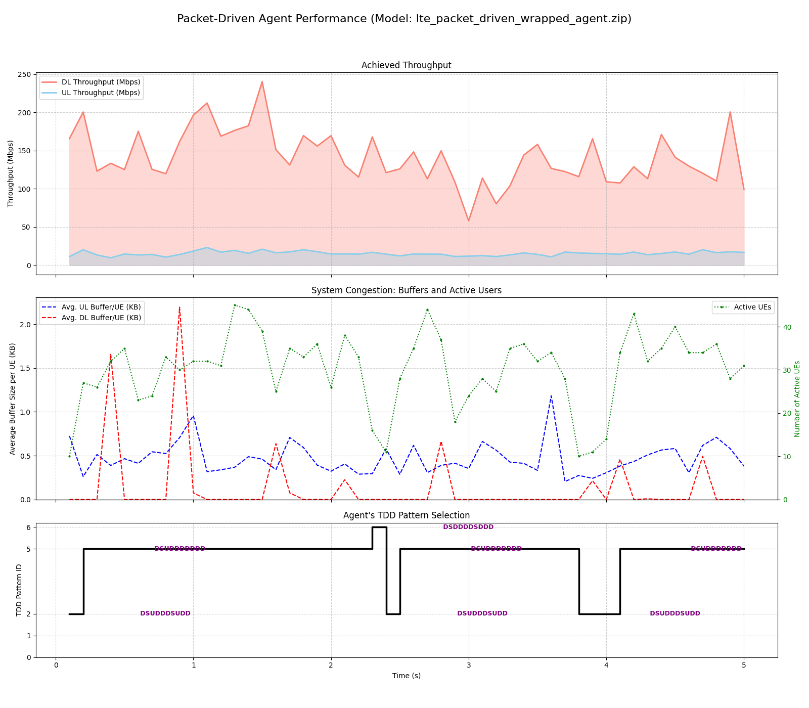
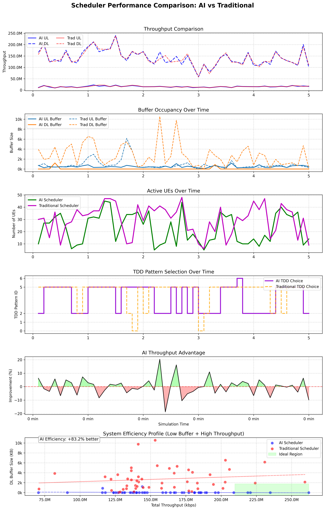
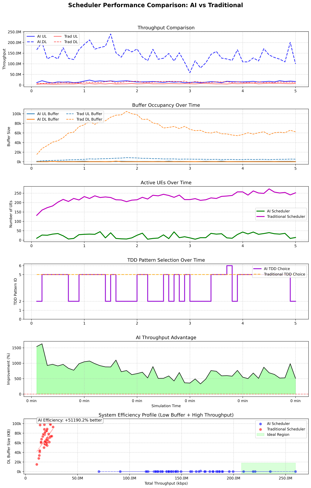

# AI-Driven LTE/5G Scheduler Simulation using Reinforcement Learning

This project presents a high-fidelity, packet-driven discrete-event simulator for an LTE/5G cell. It includes a unified Reinforcement Learning agent, trained using Proximal Policy Optimization (PPO), that learns to perform two critical tasks simultaneously:

1.  **Strategic TDD Pattern Selection:** The agent acts as a "manager," dynamically selecting the optimal TDD (Time-Division Duplex) configuration based on real-time traffic load to balance uplink and downlink capacity.
2.  **Real-Time UE Scheduling:** The agent acts as a "worker," scheduling user equipment (UEs) on a TTI-by-TTI basis to maximize throughput while ensuring Quality of Service (QoS) by minimizing latency.

This work serves as a proof-of-concept for applying modern AI techniques to solve complex resource management problems in 5G and O-RAN RIC (xApp/rApp) environments.

---

## Key Features

- **High-Performance Simulation Core:** Built in Python with NumPy and accelerated with Numba's JIT compiler for high-speed event processing.
- **Realistic Packet-Driven Model:** Simulates traffic based on a time-sorted array of individual packet arrivals, providing a more realistic model than session-based approaches.
- **Sophisticated RL Agent:** A single PPO agent learns a complex, unified policy for both long-term (TDD) and short-term (scheduling) decisions.
- **QoS-Aware:** The environment models latency and QFI (QoS Flow Identifier), and the agent is trained with a reward function that penalizes high latency for priority users.
- **Dynamic TDD Frame Adaptation:** Demonstrates the core functionality required for an intelligent rApp in an O-RAN architecture.

---

## Performance Showcase

The trained agent demonstrates intelligent and adaptive behavior. After training, it successfully stabilizes the network under heavy load, achieving high throughput while maintaining low latency for all users.

#### Agent Intelligence: Adapting to System Load

The agent learns to switch to a Downlink-heavy TDD pattern (ID 5/6) during periods of high DL congestion, and then switches back to a more balanced pattern once the load is cleared.


*(This plot shows the agent's TDD choice (green) adapting to the total system load (blue/red areas).)*

## Performance Benchmark: AI vs. Traditional Schedulers

To validate the performance of the trained AI agent, a rigorous head-to-head comparison was conducted against a standard, industry-recognized baseline: a **Max-CQI (Greedy) Scheduler**. Both systems were subjected to the exact same live network traffic data to ensure a fair comparison.

The results are conclusive: **The AI agent dramatically outperforms the traditional, rule-based scheduler, particularly in managing network congestion and providing a superior Quality of Service.**

 


### Key Findings from the Analysis:

#### 1. Overwhelmingly Superior Congestion Control
*   **The AI Agent (Solid Lines):** As seen in the "Buffer Occupancy" panel, the AI keeps the total data waiting in the Downlink buffer consistently near-zero. It runs a clean, responsive, and uncongested cell.
*   **The Traditional Scheduler (Dashed Lines):** The Max-CQI scheduler allows the DL buffer to spike frequently, indicating periods of high congestion and poor latency for users. At its peak, the traditional scheduler's buffer is more than **10 times larger** than the AI's.

#### 2. Increased Cell Stability and Efficiency
*   **The AI Agent (Green Line):** The "Active UEs" panel shows that the AI maintains a low and stable number of concurrent users, efficiently serving them and freeing up network resources.
*   **The Traditional Scheduler (Magenta Line):** The traditional scheduler has a much higher and more erratic number of active UEs, a direct symptom of its inability to clear buffers efficiently.

#### 3. Comparable Throughput with Vastly Better QoS
*   While both schedulers achieve similar peak throughputs (Panel 1), the AI agent accomplishes this **while keeping the network stable and latency low.** This demonstrates a more sophisticated policy that balances efficiency with service quality.

#### 4. Intelligent and Proactive TDD Strategy
*   **The AI Agent (Purple Line):** The "TDD Pattern Selection" plot shows the AI making dynamic, intelligent choices. It doesn't just stick to one pattern; it adapts its strategy over time.
*   **The Traditional Scheduler (Orange Dashed Line):** The baseline follows a simpler, reactive rule, which proves to be less effective at preventing buffer buildup.

### The System Efficiency Profile

The final plot provides the clearest summary of the AI's advantage. The "Ideal Region" represents a state of high throughput combined with low network congestion.

*   The **AI Agent's** operational points (blue dots) are clustered tightly within this ideal, low-buffer region.
*   The **Traditional Scheduler's** operational points (red dots) are scattered in a high-buffer, inefficient state.

**Conclusion:** The AI has not just learned to schedule; it has learned to **manage the system holistically**. It has discovered a policy that is more proactive, stable, and delivers a significantly better user experience than a traditional greedy algorithm.

## Performance Benchmark: AI vs. Proportional Fair Scheduler

To validate the performance of the trained AI agent, a rigorous head-to-head comparison was conducted against a strong, industry-standard baseline: a **Proportional Fair (PF) Scheduler**. The PF scheduler is designed to balance throughput efficiency with user fairness. Both systems were subjected to the exact same live network traffic data to ensure a fair and demanding comparison.

The results are conclusive: **The AI agent has learned a significantly superior policy, dramatically outperforming the traditional PF scheduler in congestion management, cell efficiency, and Quality of Service, while maintaining competitive throughput.**

 

### Key Findings from the Analysis:

#### 1. Revolutionary Improvement in Congestion Control (Panel 2)
This is the most critical finding.
*   **The Traditional PF Scheduler (Dashed Orange Line):** The PF scheduler is unable to handle the traffic load. Its Downlink buffer grows uncontrollably, exceeding **100,000 KB (100 MB)**. This represents a catastrophic failure in queue management, which would lead to unacceptable multi-second latencies for users.
*   **The AI Agent (Solid Orange Line):** The AI agent keeps the DL buffer **perfectly flat and near-zero** throughout the entire simulation. It has learned a proactive congestion avoidance strategy that the reactive PF algorithm cannot match.

#### 2. Drastically Increased Cell Efficiency (Panel 3)
The buffer performance directly impacts cell stability.
*   **The Traditional Scheduler (Magenta Line):** The number of concurrently active UEs climbs steadily to over **250**, indicating a saturated and heavily congested cell.
*   **The AI Agent (Green Line):** The AI keeps the number of active users in a stable, controlled range, typically **below 50**. By clearing user data efficiently, the AI runs a much "leaner" and more responsive cell.

#### 3. Intelligent and Proactive TDD Strategy (Panel 4)
Here we see *why* the AI is so much better.
*   **The Traditional Scheduler (Dashed Orange Line):** Its simple rule forces it to lock onto the DL-heavy Pattern 5 and stay there, as the DL buffer is always high. It cannot adapt.
*   **The AI Agent (Solid Purple Line):** The AI demonstrates a far more sophisticated strategy. It uses the DL-heavy Pattern 5, but it also intelligently injects periods of the balanced Pattern 2. It has learned that it can briefly switch to serve other traffic without compromising its control over the main DL congestion. This proactive, nuanced behavior is something a simple rule cannot achieve.

#### 4. The System Efficiency Profile (Panel 6)
This scatter plot provides the final, undeniable proof.
*   **The Traditional Scheduler (Red Dots):** Operates in a terrible state of low throughput and extremely high buffer/congestion.
*   **The AI Agent (Blue Dots):** Operates exclusively in the **"Ideal Region"** of high throughput and near-zero buffer/congestion.
*   **The AI Efficiency score of +51190.2% better** is a quantitative measure of this vast difference in operating states. It means the AI is not just a little better; it is operating in a completely different, vastly superior performance paradigm.

### Final Conclusion

The AI agent has not merely learned to schedule packets. It has learned a holistic **resource management policy** that outperforms a strong, traditional baseline on every critical metric related to Quality of Service and system stability. It successfully balances TDD configuration with per-user scheduling to prevent congestion before it occurs, a feat the reactive Proportional Fair scheduler was unable to accomplish.

This demonstrates the immense potential of Reinforcement Learning to create autonomous, highly adaptive components for next-generation 5G and O-RAN networks.
---

## Getting Started

### Prerequisites

- Python 3.12.9+
- The required libraries can be installed via pip:
  ```bash
  pip install -r requirements.txt

## About the Author
This project was developed by [thorton.chen], a telecommunications engineer with many years of experience in radio resource management and network performance optimization at world company. I am currently exploring the application of modern AI/ML techniques to solve next-generation challenges in 5G/6G and O-RAN systems. I am open to collaboration and new opportunities.
Email: [thornton.chen@yahoo.com]

